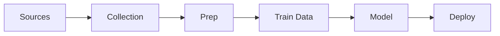

<h1 align="center">Troyonix: Legal-Compliant Financial AI</h1> <h2 align="center"> Enterprise-grade, open-source AI for wealth management and financial analysis. </h2> <!-- Trigger new CI run -->---

<p align="center">
  
  
  
  
</p>

---

## 📖 Table of Contents

- [What We're Open-Sourcing](#-what-were-open-sourcing)
- [Architecture](#-architecture)
- [Legal-First Approach](#-the-troyonix-legal-first-approach)
- [Quick Start](#-quick-start)
- [Performance](#-performance)
- [Why Contribute?](#-why-contribute-to-troyonix)
- [Future Work & Roadmap](#future-work--roadmap)
- [Use Cases](#-use-cases)
- [Community & Contributing](#community--contributing)
- [License](#-license)

---

## 🚀 What We're Open-Sourcing

This repository contains the foundational layers of the Troyonix AI platform—core data processing, compliance-first pipelines, and model training tools.

**Key Features:**
- **Legal-Compliant Data Pipeline:** Collects only public-domain sources (SEC EDGAR, FRED).
- **Wealth Management Specialization:** Advanced preprocessing and a fine-tuned FinBERT model for financial sentiment.
- **Full Transparency:** Complete documentation on data lineage, processing, and legal considerations.

---

## 🏗️ Architecture



---

## 🛡️ The Troyonix Legal-First Approach

Only these sources are used:
- **SEC EDGAR Filings**: Public domain corporate financial data.
- **Federal Reserve Economic Data (FRED)**: Official US economic indicators.
- **Policy Uncertainty Indices**: Academic, open-access sentiment measures.

**Compliance is enforced in code—see [`src/data_collection`](src/data_collection) for implementation details.**

---

## 🚀 Quick Start

Get the pipeline running fast!

```bash
# 1. Clone the repository
git clone https://github.com/TroyonixAI/troyonix-financial-ai.git
cd troyonix-financial-ai

# 2. Set up your environment (Python 3.8+)
python -m venv venv
# On Linux/macOS:
source venv/bin/activate
# On Windows:
venv\Scripts\activate

pip install -r requirements.txt

# 3. Configure your API keys (optional, for FRED data)
cp config/config.example.json config/config.json
# Add your FRED API key to config.json

# 4. Run the data pipeline
python src/data_collection/collect_all_data.py
python src/preprocessing/prepare_training_data.py

# 5. Train the model
python src/training/train_finbert.py

# 6. Evaluate & run inference
python src/analysis/evaluate_model.py
python src/analysis/run_inference_examples.py
```

**Troubleshooting:**  
- Ensure your Python version is ≥ 3.8.  
- If you hit dependency errors, try upgrading pip: `pip install --upgrade pip`

---

## 📊 Performance

| Metric    | Score   |
| --------- | ------- |
| Accuracy  | _TBD_   |
| Precision | _TBD_   |
| Recall    | _TBD_   |
| F1-Score  | _TBD_   |

*Run evaluation yourself via `python src/analysis/evaluate_model.py`.*  
*We’re working toward benchmarks on Financial PhraseBank and other datasets.*

---

## 🌟 Why Contribute to Troyonix?

- **Shape the Future:** Build a transparent, compliant AI for finance.
- **Grow Your Skills:** Collaborate with experts in AI, finance, and compliance.
- **Make an Impact:** Your code will be used by professionals worldwide.
- **Get Recognized:** Top contributors featured in docs and blogs.

---

## Future Work & Roadmap

**Short Term**
- Expand labeled datasets (community input welcome!)
- Add more evaluation metrics and visualizations

**Long Term**
- Integrate global filings and alternative data sources
- Advance model capabilities (risk, compliance, portfolio analytics)
- Enhance explainability and audit trails

[Submit feature requests or vote on roadmap items here.](https://github.com/TroyonixAI/troyonix-financial-ai/issues)

---

## 📊 Use Cases

- **Wealth Management Firms:** Build legal/compliant portfolio and risk tools.
- **Financial Analysts:** Automate SEC filings and economic report analysis.
- **Fintech Startups:** Use as a foundation for compliant financial AI products.

---

## Community & Contributing

We welcome contributions!  
**How to contribute:**
1. Fork this repo and create a new branch.
2. Make your changes and add tests where appropriate.
3. Submit a pull request with a clear description of your changes.
4. For ideas, see our [open issues](https://github.com/TroyonixAI/troyonix-financial-ai/issues) or [CONTRIBUTING.md](CONTRIBUTING.md).

**Join the community:**  
- [GitHub Discussions](https://github.com/TroyonixAI/troyonix-financial-ai/discussions)
- (Add Slack/Discord link if available)

---

## 📄 License

This project is licensed under the [MIT License](LICENSE).

---

**Built by a founder who believes in transparency, legal compliance, and the power of community.**

---
